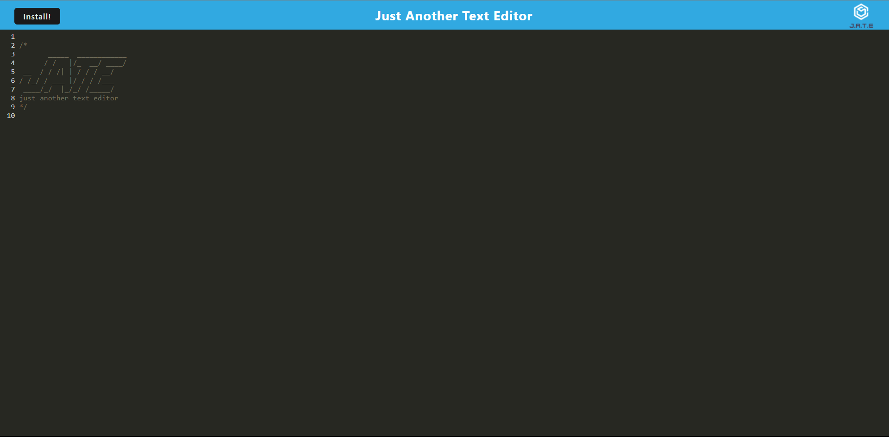

# Just Another Text Editor (J.A.T.E)

## Overview

J.A.T.E (Just Another Text Editor) is a lightweight and easy-to-use text editor. It provides a clean and intuitive interface for editing your text files.

## Features

- Clean and user-friendly interface.
- Ability to install to local computer.
- Works offline.

## Getting Started

### Prerequisites

- Compatible with modern web browsers.
- npm package.

### Installation

To install it to your local system use the following steps:

1. Clone this repository:

2. Run this code in the root directory, server folder, and client folder to install the required assets

-           npm install

3. To run the app navigate to the root directory and run:

-           npm run start

4. Go to the local host port thats specified in the terminal.

### Usage

1. Open the text editor in your web browser.
2. Start editing your text.

## Contact Information

- Email: masonschnell1@gmail.com
- GitHub: [MasonSchnell](https://github.com/MasonSchnell)

## Acknowledgments

- Rutgers Full Stack Development Team

## License

This project is licensed under the [MIT license](https://opensource.org/licenses/MIT).
